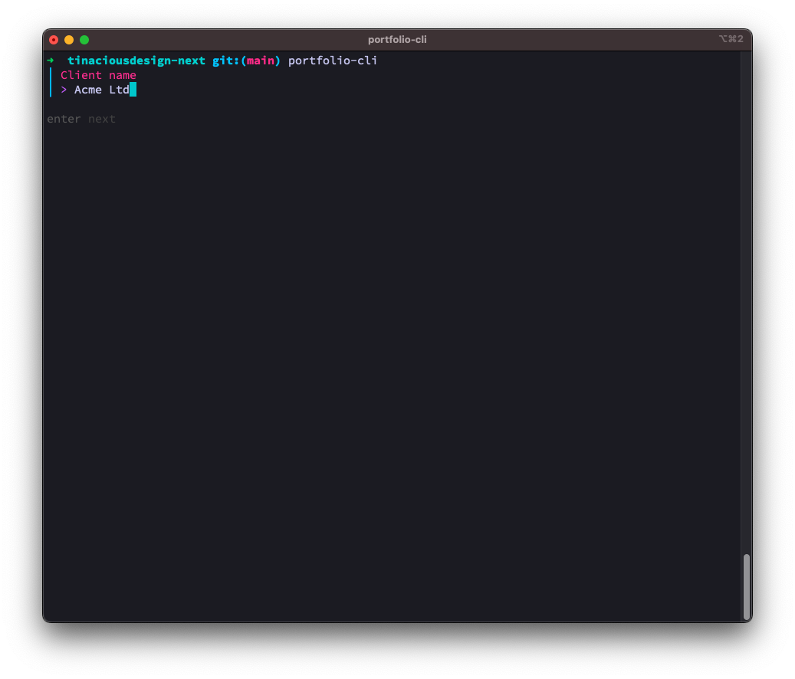
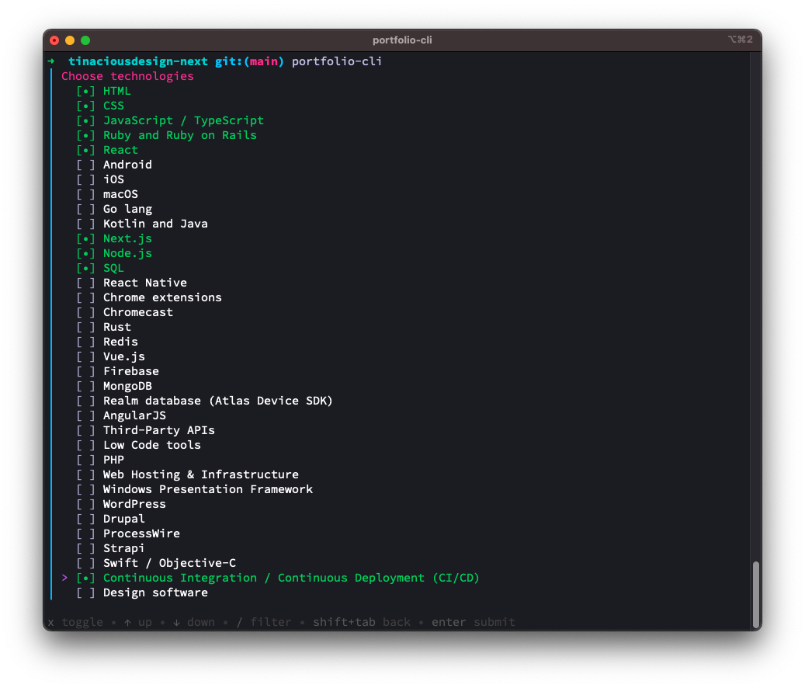
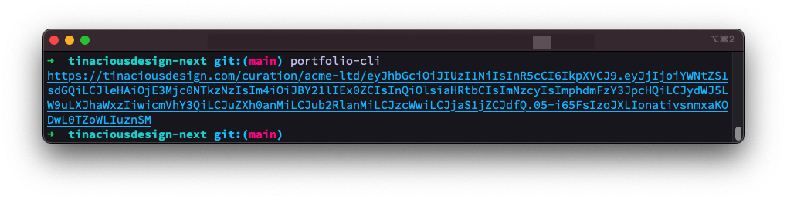
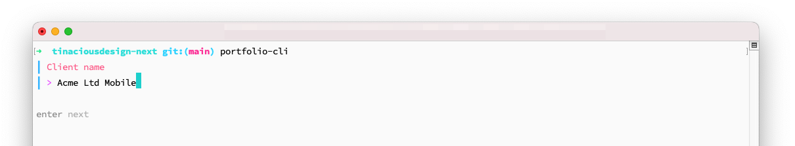
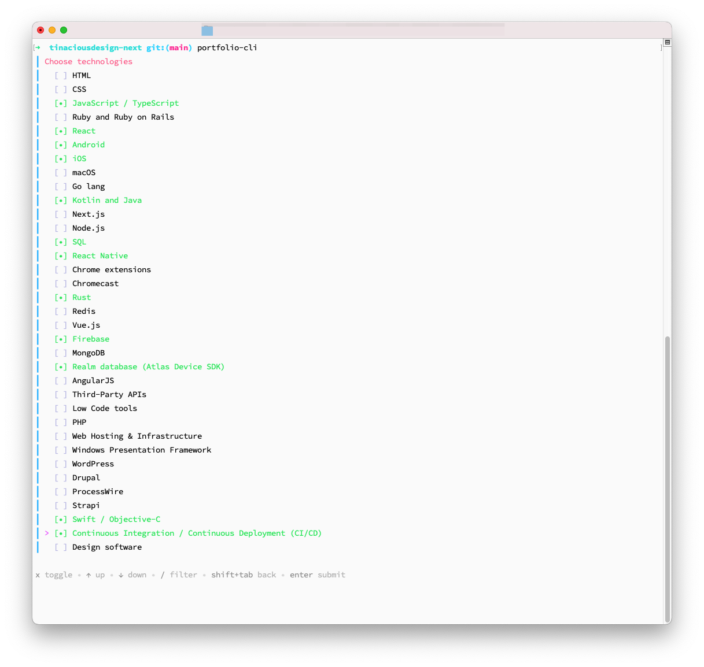
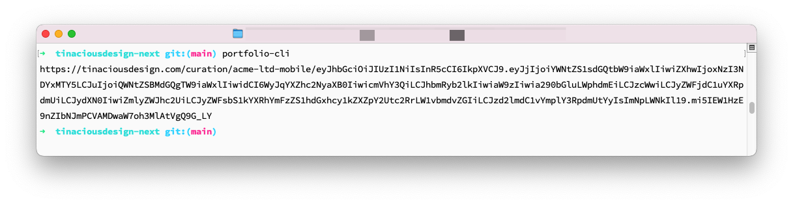

# portfolio-cli

`portfolio-cli` is a tool that Tina uses to build custom links to curate portfolio items for specific clients and job applications, because it's 2024 and we now have to apply for jobs 🤷🏻‍♀️

It requires the environment variable `TINACIOUS_DESIGN_JWT_SECRET` be set. This would be the same JWT token used to read it server-side. You probably wouldn't know it unless you're Tina.

- [Installation](#installation)
- [Usage](#usage)
- [Screenshots](#screenshots)
	- [Light mode](#light-mode)
- [Development](#development)


## Installation

Install the CLI tool:

	go install github.com/tinacious/portfolio-cli@latest


## Usage

Run the command `portfolio-cli` and fill out the form.


## Screenshots

Configuring the link for the client name, e.g. `Acme Ltd`.



After hitting Enter, I can choose which technologies I want to highlight, picking only technologies relevant for the role so as to not overwhelm the recruiter or hiring manager.



This results in a custom link that is valid for 60 days which can be copied to the clipboard, e.g. if you do `portfolio-cli | pbcopy`.

In supported terminal emulators, holding <kbd>Command</kbd> and clicking the link will enable it to open in the default browser.




### Light mode






## Development

Install the lint tools:

```sh
go install golang.org/x/tools/cmd/goimports@latest
go install github.com/daixiang0/gci@latest
```

Run the application locally:

```sh
go run main.go
```

Run the linters:

```sh
make lint
```
